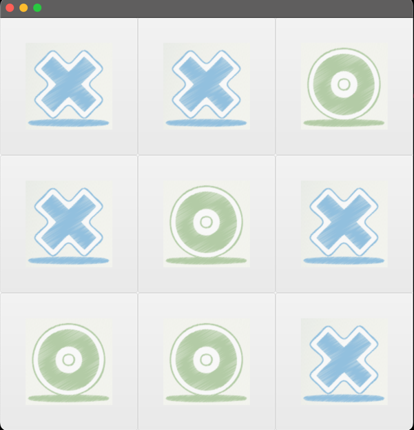
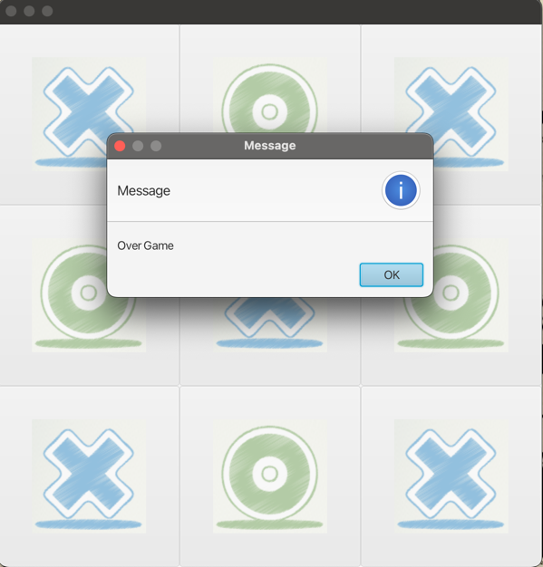

# Tic-Tac-Toe em java com JavaFx - Documentação

## Olá, eu sou Neyvaldo Gomes

Sou estudante de Engenharia Informática e estou desenvolvendo um jogo
da velha (Tic-Tac-Toe) pedido pelo professor Guia pratico 2, usando Java e JavaFX como parte do meu aprendizado. 
Este `README.md` documenta o que aprendi durante o desenvolvimento do 
trabalho.

## Objetivo

A implement do jogo é feito usando java com a biblioteca JavaFX para criar interface grafica.
O jogo permite que os dois jogadores alternem entre marca X e O em um tabuleiro de 3x3.
Quando todos os botões tiverem clicados, o jogo termina, 
os botões ficam inativos e é exibida uma message de fim de jogo, como mostra a figura:

## Aprendi a fazer

Durante o desenvolvimento deste projeto, aprendi vários conceitos e técnicas importantes:

- **JavaFX Basics**: Como criar uma interface gráfica usando `GridPane`, `Button`, `Image`, e `ImageView` para exibir um tabuleiro interativo.
- **Event Handling**: Como usar `EventHandler<ActionEvent>` para lidar com cliques nos botões e alternar entre "X" e "O".
- **Recursos no Classpath**: Como carregar imagens (como `player1.png`, `player2.png`, e `noplayer.png`) usando `getResource` para torná-las portáteis, evitando caminhos absolutos. 
Infelizmente não consegui usar dessa forma tive que usar caminho absoluto

## Estrutura do projeto

O projeto é construido por seguintes partes:

- **`TicTacToeBoard` que ( ***extends*** `GridPane `)** 
  - Essa classe contem um método `createBoard ()` que cria um tabuleiro de 3x3 com botöes
 
 
- **`ButtonHandler` que ( implements `EventHandler<ActionEvent>` )**
   -  Lida com cliques dos botões, alternando de `X` e `O`
   - Desativa o botão quando ele é clicado
   - Tem variable `count` para contar quando todos os botões estiveram clicados, lançando uma alerta de fim de jogo.
 
   
- **`TicTacToeButton` que ( implements `Button` )**
   - Essa classe não tem nada ainda, mais futuramente podera implementar metodos para o button

- **Image**
  - `player1.png` (para "X"), `player2.png` (para "O"), e `noplayer.png` (para  vazias), carregadas do classpath.

- **`resetGame()`**
  - Metody criado para deixar o board vazia
